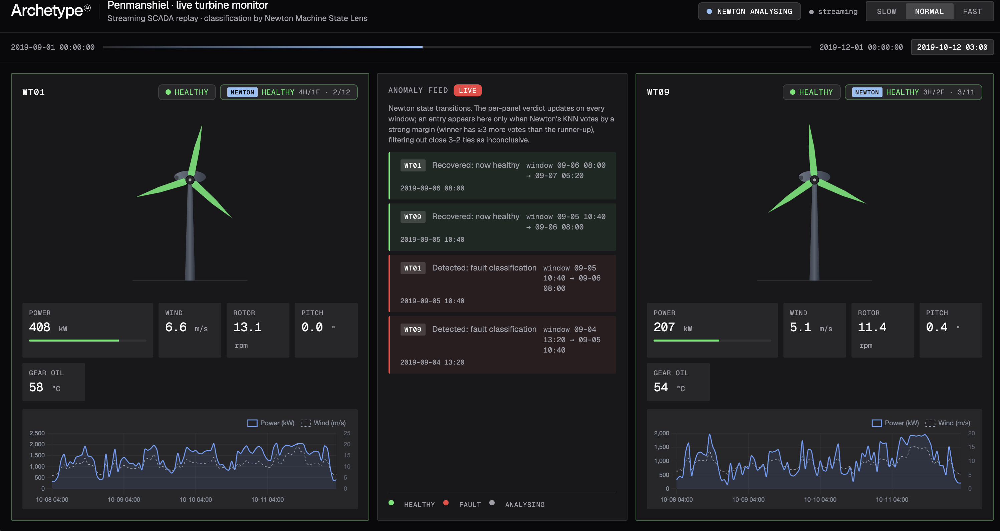

# Penmanshiel · live turbine anomaly monitor

A side-by-side live demo of [Archetype AI's Newton](https://www.archetypeai.io/) **Direct Query API** classifying real wind-turbine SCADA telemetry. Three months of data from the Penmanshiel wind farm are replayed at hourly cadence in the browser; each ~21-hour window is embedded by the Omega encoder (one `/query` per channel) and scored by a **local KNN** against an n-shot library of `healthy` / `fault` reference windows — no lens, no session, no SSE plumbing. The verdicts drive the per-turbine state, the anomaly feed, and the SVG blade colours in real time.

**All inference — every state badge, every anomaly feed entry, every blade colour — comes from Newton.** There is no local heuristic; the Flask backend is a thin replay-streamer plus a background Direct-Query classifier (built on the official `archetypeai` Python client).

The dataset features a documented frequency-converter outage on **WT01** in early November 2019. Its healthy peer **WT09** runs the same hardware on the same hill in the same minute-by-minute wind. The demo invites you to watch Newton find the difference.



## What the app does

- **Replays** 2,184 hourly SCADA ticks (2019-09-01 → 2019-12-01) for WT01 + WT09 over an SSE stream, driven by a **Start / Stop** control.
- **Classifies each 128-sample (~21 h) window via Direct Query** — the four signal channels are embedded by the Omega encoder (one `/query` per channel, fanned out in parallel) and scored by a local KNN against the n-shot library (see [Architecture](#architecture-direct-query--local-knn)).
- **Runs the classifier in a background thread** and drains `newton_prediction` verdicts onto the SSE stream (~50 windows per turbine), paced to the replay timeline so a verdict surfaces as the playhead reaches its window.
- **Emits debounced anomaly events** on strong-majority verdict transitions (`fault` ↔ `healthy`) — see [Anomaly logic](#anomaly-logic) for the why.
- **Renders the dashboard** in the Archetype AI design system (Geist sans + Geist Mono, OKLCH palette, 2 px radii, FlatLogItem-style feed). Following [`agent-skills/DESIGN.md`](https://github.com/archetypeai/agent-skills/blob/main/DESIGN.md) — see [`templates/index.html`](templates/index.html) and [`static/style.css`](static/style.css).

## Dataset

Loaded from `./data/`. The full Penmanshiel release (~2 GB, not committed) is published by Cubico Sustainable Investments on Zenodo via Greenbyte — 14 turbines on the Scottish-Borders site, 2019 calendar-year SCADA at 10-minute cadence, status logs, grid-meter time-series, and PMU readings.

The demo needs (all in the WT01–10 SCADA zip):
- `data/Penmanshiel_WT_static.csv` — turbine metadata (Senvion MM82, 2,050 kW rated, 82 m rotor)
- **WT01 + WT09** full-year 10-minute SCADA — the two turbines replayed live
- **WT05 + WT06** full-year 10-minute SCADA — the n-shot reference turbines (fault outage / autumn-healthy)

The replay window (Sept 1 → Dec 1, ~13 k rows per turbine) is a slice of those CSVs. The n-shot references are **leakage-free** — they share no turbine-and-time with what we classify, so WT01's November fault is genuinely *unseen* (`_build_library()` asserts this before building):

| Class | Source | Window | Why disjoint from the live data |
|---|---|---|---|
| `healthy` | WT09 | 2019-07-01 → 2019-07-22 | summer — a different time than the live window |
| `healthy` | WT06 | 2019-10-01 → 2019-10-22 | a different turbine (autumn baseline → matches the live season) |
| `fault` | WT05 | 2019-03-08 06:00 → 03-10 00:00 | a different turbine's sustained ~36 h frequency-converter outage |

Per the [`atai-newton-omega-model`](https://github.com/archetypeai/agent-skills/tree/main/skills/atai-newton-omega-model) skill, every window is z-scored per channel with a global scaler fit on the reference pool and embedded with `normalize_input: false` (preserving cross-window amplitude). Healthy windows are capped to balance the KNN vote against the fewer fault windows. **Why cross-turbine for `fault`:** WT01's only 2019 fault is the November event we replay — using it as the reference would be leakage, so the fault class is learned from WT05's *same-type* outage instead, and detecting WT01's is genuine generalization.

### Fetching the data

The dataset lives on Zenodo — either [record 16807304](https://zenodo.org/records/16807304) (newer; also mirrored on [HLRS WindLab](https://windlab.hlrs.de/dataset/zenodo-16807304/resource/b16ea689-f8ca-4873-bf19-81110daf191c)) or [record 5946808](https://zenodo.org/records/5946808) (the original release). Both contain the same WT01–15 Penmanshiel SCADA at 10-minute cadence; the filenames and directory layout below are identical between the two — substitute either record number into the URLs. License: CC-BY-4.0.

You need **two files** for this demo — the SCADA zip that contains WT01 and WT09, plus the static metadata:

```bash
mkdir -p data && cd data

# WT01-10 2019 SCADA (~1.9 GB zipped, includes WT01 + WT09)
wget https://zenodo.org/api/records/16807304/files/Penmanshiel_SCADA_2019_WT01-10_3112.zip/content \
    -O Penmanshiel_SCADA_2019_WT01-10_3112.zip
unzip Penmanshiel_SCADA_2019_WT01-10_3112.zip
rm Penmanshiel_SCADA_2019_WT01-10_3112.zip

# Static metadata (rated power, hub height, lat/long, etc.)
wget https://zenodo.org/api/records/16807304/files/Penmanshiel_WT_static.csv/content \
    -O Penmanshiel_WT_static.csv

cd ..
```

After extraction your `data/` directory should look like:

```
data/
├── Penmanshiel_WT_static.csv
└── Penmanshiel_SCADA_2019_WT01-10_3112/
    ├── Turbine_Data_Penmanshiel_01_2019-01-01_-_2020-01-01_1075.csv  # WT01 (faulty)
    ├── Turbine_Data_Penmanshiel_09_2019-01-01_-_2020-01-01_1075.csv  # WT09 (healthy peer)
    ├── Turbine_Data_Penmanshiel_02_2019-01-01_-_2020-01-01_1075.csv
    ├── Status_Penmanshiel_01_…csv
    └── … (other turbines and status logs, not used by the demo)
```

At runtime the demo reads only the **WT01** and **WT09** turbine-data CSVs plus the static metadata. The **WT05** and **WT06** CSVs are read once by `build_library.py` to embed the n-shot reference windows (all four turbines are in the same WT01–10 zip). The remaining files in the zip (WT02, WT04, WT07, WT08, WT10, status logs) are harmless extras — `data_loader.discover_turbines()` enumerates whatever is present.

**Optional extras**, not needed for the demo:
- `Penmanshiel_SCADA_2019_WT11-15_3117.zip` — WT11–15 2019 SCADA.
- `Penmanshiel_WT_dataSignalMapping.xlsx` — column-name reference for the SCADA exports.

## Setup

Requires Python 3.11+ (Archetype AI SDK needs ≥ 3.10), Archetype AI API credentials for staging or prod, and the Penmanshiel dataset.

```bash
# Clone
git clone https://github.com/archetypeai/archetypeai-wind-turbine-demo.git
cd archetypeai-wind-turbine-demo

# Fetch the dataset (see above) into ./data/

# Credentials
cp .env.example .env
# Edit .env with your ATAI_API_KEY and ATAI_API_ENDPOINT

# Virtual env
python3.11 -m venv .venv
.venv/bin/pip install -r requirements.txt

# Precompute the n-shot reference library once (writes library.json)
.venv/bin/python build_library.py

# Run
.venv/bin/python app.py
open http://127.0.0.1:5050/
```

`build_library.py` embeds the static reference windows offline and saves them to
`library.json`, so the app loads them instantly at runtime instead of re-embedding
on every cold start. If `library.json` is missing (or you change a reference window /
window size / model), the app rebuilds it live on the first **Start** — and you can
re-run `build_library.py` to refresh the file. With the library precomputed, runtime
only needs the **WT01 + WT09** data; the reference turbines (WT05, WT06) are only read
when building the library.

Press **Start** to begin the replay (and **Stop** to end it). The library load is
near-instant, so classification begins right away.

## Using the UI

- **Top bar**: Archetype AI wordmark · title · live `Building reference library…` / `Newton analysing` / `Newton complete` status pill · connection-state dot (`idle` → `streaming` → `ready`) · **Start / Stop** button.
- **Timeline strip**: simulated date range with a cursor that advances per tick; `t-now` mono readout on the right.
- **Per-turbine panel** (left and right of the feed):
  - `ANALYSING` / `HEALTHY` / `FAULT` state badge (driven by Newton's *debounced* state).
  - `NEWTON {class} {H/F · X/Y}` verdict badge — updates the vote counter on every prediction, but the colour/pulse only flips on strong-majority verdicts (filters out close 3-2 KNN ties).
  - Animated SVG turbine — rotor spin tracks measured RPM; blade colour mirrors the panel state.
  - Numeric stat row (Power / Wind / Rotor RPM / Pitch / Gear oil) in mono with current-window values.
  - Rolling 96-tick power + wind sparkline.
- **Anomaly feed** (centre column): strong-majority state transitions ("Detected: fault classification", "Recovered: now healthy") with the window range and timestamp. Single 3-2 KNN flickers are intentionally suppressed.

<a id="architecture-direct-query--local-knn"></a>
## Architecture: Direct Query + local KNN

There is **no lens and no session** in this demo. Each window is embedded with one stateless `POST /v0.5/query` call per channel against the Omega encoder, and classification is a plain k-nearest-neighbour vote against an in-memory reference library — entirely on our side. This is the [`atai-newton-omega-model`](https://github.com/archetypeai/agent-skills/tree/main/skills/atai-newton-omega-model) skill's recommended downstream pattern.

```
                ┌─────────────────────────────────────────────┐
                │            Archetype AI Newton              │
                │   POST /v0.5/query   (stateless, no session)│
                │   model: OmegaEncoder::omega_embeddings_1_4 │
                │   normalize_input: false                    │
                └───────────────▲────────────┬────────────────┘
                  one /query per │            │ 768-d embedding
                  channel (×4)   │            │ per channel
                                 │            ▼
   ┌─────────────────────────────┴──────────────────────────────┐
   │  Flask backend (newton_client.BackgroundClassifier)         │
   │                                                             │
   │  offline 1×:  reference windows ──► z-score (global scaler) │
   │  (saved to    ──► embed ──► concat 4 channels ──► library   │
   │  library.json)                                              │
   │                                                             │
   │  per window:  WT01/WT09 slice ──► z-score ──► embed ──►      │
   │               concat ──► KNN(k=5) vs library ──► {class,vote}│
   └─────────────────────────────────────────────────────────────┘
```

### How it works

1. **Build the library once, offline** (`build_library.py` → `save_library`). The curated reference windows (table above) are sliced, z-scored with a single global scaler fit on the reference pool, embedded channel-by-channel, and concatenated into one vector per window — then persisted to `library.json` with the scaler and a config fingerprint. Healthy windows are capped (`HEALTHY_CAP`) so the KNN vote isn't swamped by the larger healthy class. `_assert_disjoint()` runs first and raises if any reference window overlaps the live turbines/time — leakage fails loudly rather than silently inflating accuracy. At runtime `_build_library()` loads `library.json` instantly (no `/query` calls); if it's missing or the fingerprint changed, it rebuilds live. This is the [`atai-newton-omega-model-data-prep`](https://github.com/archetypeai/agent-skills/tree/main/skills/atai-newton-omega-model-data-prep) offline/runtime split.
2. **Classify in the background** (`BackgroundClassifier`). A worker thread walks both live turbines' replay windows, embeds each the same way, runs `_knn(vec, library, k=KNN_K)`, and pushes `newton_prediction` events (with `class`, `votes`, and a `tick_index` mapping the window onto the replay timeline) onto a queue. `app.py` drains that queue and *releases* each prediction when the visible timeline reaches its `tick_index`, so predictions stay aligned with the scrubbing playhead.
3. **Per-channel fan-out with retries** (`_embed_window`). The four channels for a window are embedded concurrently through a `ThreadPoolExecutor` (`OMEGA_MAX_CONCURRENCY`), each call retried up to `OMEGA_RETRIES` times — the same bounded-concurrency `embed()` shape the skill uses.

All of this lives in [`newton_client.py`](newton_client.py); the official [`archetypeai`](https://pypi.org/project/archetypeai/) Python client makes the `/query` calls via `client.requests_post`.

## Anomaly logic

KNN on a small n-shot library returns the occasional split (4-1, 3-2) vote on borderline windows. The demo treats a verdict as **strong** only when the winning class leads the runner-up by ≥ `STRONG_MARGIN` votes (with `k=5`: 5-0 or 4-1 qualify; 3-2 doesn't). `app.py:_anomaly_from` commits a state change — and fires an anomaly entry — only on the first strong verdict in a new direction; weak verdicts update the vote counter but don't flip the panel. The per-panel verdict badge surfaces the raw votes so users can see *why* each decision fired.

Validated on held-out windows (none in the library): WT01's November fault is detected as it develops — the onset window still reads healthy, then flips to fault — with **zero false positives** on the healthy turbine and its peers.

## API surface

| Endpoint | What it returns |
|---|---|
| `GET /` | The dashboard UI |
| `GET /api/scada/<wt_id>` | Downsampled 3-month SCADA series for a single turbine (JSON, debug aid) |
| `GET /api/replay?tps=N` | SSE stream: `meta`, `newton_status`, `tick`, `newton_prediction`, `anomaly`, `complete` |

`tps` (ticks/sec) clamps to `[1, 200]`; the replay duration scales linearly with it. The UI requests a fixed `tps=15` (the Start button) for a steady ~2.5-minute replay, but the endpoint accepts any value. The background classifier runs ahead of the playhead; `app.py` buffers its predictions and releases each one as the visible timeline reaches its `tick_index`, so predictions stay aligned with playback at any speed.

## Project layout

```
app.py                         # Flask + SSE; tick loop; prediction release + anomaly synth
build_library.py               # Offline: embed reference windows → library.json (run once)
library.json                   # Precomputed n-shot library (scaler + vectors + fingerprint)
newton_client.py               # Direct Query + local KNN:
                               #   _get_client, ensure_scaler, _scale_frame,
                               #   _embed_channel / _embed_window (Omega /query),
                               #   _knn, save_library / _load_library,
                               #   _build_library (disk → live fallback),
                               #   BackgroundClassifier (worker thread),
                               #   replay_events (pure SCADA tick streamer)
data_loader.py                 # CSV reader, window slicing, hourly downsampling
templates/index.html           # Topbar + timeline + 3-column grid
templates/_turbine_card.html   # Reusable panel: state badge, SVG, stats, spark
templates/_wordmark.svg        # Archetype AI wordmark (inlined for currentColor)
static/style.css               # OKLCH tokens, Geist fonts, sharp radii, FlatLogItem feed
static/app.js                  # SSE consumer, panel updates, rotor RAF loop, Chart.js spark
requirements.txt
.env.example
LICENSE                        # Apache-2.0
```

## Lessons learned

- **Leakage discipline drives accuracy, not model tuning.** The first build classified almost everything backwards because the fault reference (WT05, Mar 7–17) was mostly *non-fault* hours and the only healthy reference was summer-only — so the KNN keyed on season and turbine identity, not on fault. Tightening the fault reference to WT05's sustained ~36 h outage, adding an autumn healthy baseline (WT06 Oct) to match the live season, and capping the healthy class fixed it. `_assert_disjoint()` enforces the rule in code.
- **No lens, no session — Direct Query is simpler and stateless.** Embedding each window with `POST /v0.5/query` and running KNN locally removes the entire lens-runner orchestration (sessions, runner quotas, push pacing, orphan cleanup) that the earlier lens-based build wrestled with. See the [`atai-newton-omega-model`](https://github.com/archetypeai/agent-skills/tree/main/skills/atai-newton-omega-model) skill.
- **`normalize_input: false` + a fitted global scaler** preserves cross-window amplitude so a stopped turbine looks different from a running one — the skill's recommended downstream pattern.

## Credits

- **SCADA data**: Cubico Sustainable Investments, Penmanshiel wind farm. Zenodo records [16807304](https://zenodo.org/records/16807304) (newer) and [5946808](https://zenodo.org/records/5946808) (original); HLRS WindLab [mirror](https://windlab.hlrs.de/dataset/zenodo-16807304/resource/b16ea689-f8ca-4873-bf19-81110daf191c). CC-BY-4.0.
- **Inference**: Archetype AI Newton Direct Query API (`OmegaEncoder::omega_embeddings_1_4`) with local KNN classification — no lens, no session.
- **Visual design**: [Archetype AI design system](https://github.com/archetypeai/agent-skills/blob/main/DESIGN.md) — Geist + Geist Mono, OKLCH palette, sharp 2 px radii.

## License

Apache-2.0 — see [LICENSE](LICENSE).
